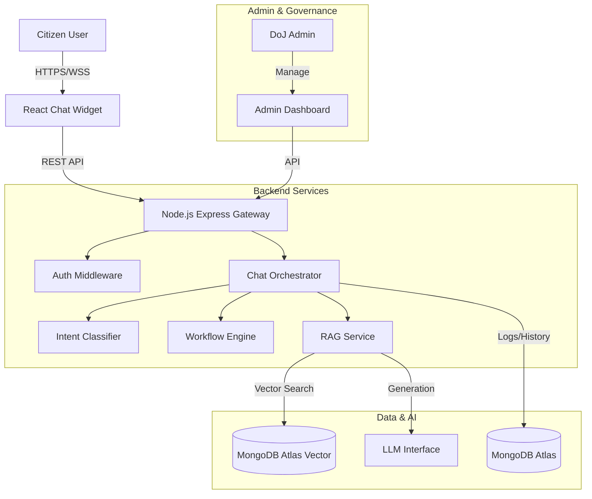
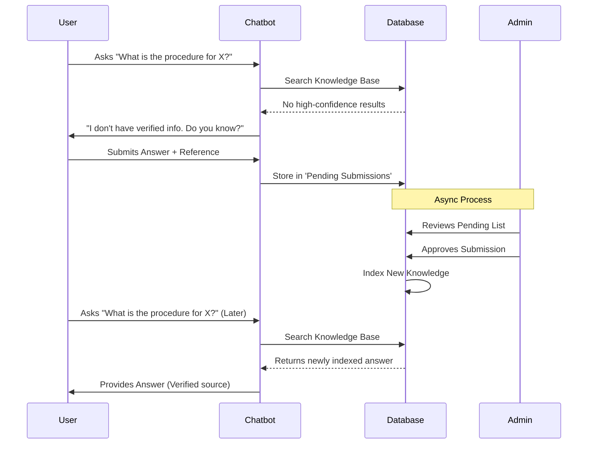

# Software Requirements Specification (SRS)
## AI-based Interactive Chatbot / Virtual Assistant for DoJ Website

| **Project Name** | DoJ Interactive Chatbot |
| :--- | :--- |
| **Document Version** | 1.1 |
| **Status** | **Final Draft** |
| **Date** | 20 Feb 2026 |
| **Prepared By** | Mugunthan (Capstone Project) |
| **Organization Domain** | Government e-Governance / Smart Automation |
| **Target Platform** | Web (DoJ site embedded chat widget) |

---

## **Table of Contents**

1.  [Introduction](#1-introduction)
2.  [Overall Description](#2-overall-description)
3.  [System Features and Functional Requirements](#3-system-features-and-functional-requirements)
4.  [External Interface Requirements](#4-external-interface-requirements)
5.  [System Architecture](#5-system-architecture)
6.  [Data Requirements](#6-data-requirements)
7.  [Non-Functional Requirements](#7-non-functional-requirements)
8.  [System Workflows](#8-system-workflows)
9.  [Verification & Validation](#9-verification--validation)
10. [Appendices](#10-appendices)

---

## **1. Introduction**

### **1.1 Purpose**
This Software Requirements Specification (SRS) document defines the complete functional and non-functional requirements for the AI-powered **Department of Justice (DoJ) Chatbot**. This system aims to solve the problem of information accessibility by providing instant, verified answers to citizen queries regarding judiciary services, eCourts, NJDG data, and legal procedures.

### **1.2 Scope**
The system is an intelligent conversational agent embedded within the official DoJ website. Its core capabilities include:
*   **Retrieval-Augmented Generation (RAG):** Answering queries using only verified official documents and FAQs.
*   **Guided Workflows:** Step-by-step assistance for complex processes like eFiling and Tele-Law registration.
*   **Verified Learning Loop (Novelty):** A "Human-in-the-Loop" mechanism to handle unknown questions, where citizen inputs are verified by admins before becoming part of the Knowledge Base.
*   **Admin Governance:** A comprehensive dashboard for content approval, analytics, and system monitoring.

### **1.3 Product Goals**
1.  **Efficiency:** Reduce the time citizens spend navigating complex legal portals.
2.  **Trust:** Ensure 100% of answers are cited from official sources.
3.  **Scalability:** Support high concurrent user traffic with robust backend architecture.
4.  **Maintainability:** Enable non-technical admins to update knowledge without code changes.

### **1.4 Definitions & Acronyms**
| Term | Definition |
| :--- | :--- |
| **DoJ** | Department of Justice |
| **NJDG** | National Judicial Data Grid |
| **RAG** | Retrieval-Augmented Generation |
| **HITL** | Human-in-the-Loop (Admin verification process) |
| **KB** | Knowledge Base (The repository of verified information) |
| **PII** | Personally Identifiable Information |

---

## **2. Overall Description**

### **2.1 Product Perspective**
The chatbot operates as a microservice within the larger DoJ web ecosystem. It interfaces with:
*   **Frontend:** A React-based widget deployable on any DoJ web page.
*   **Backend:** A Node.js/Express server handling API requests and orchestration.
*   **Database:** MongoDB Atlas for structured data and vector storage.
*   **ML Engine:** Python/Node.js services for embedding generation and retrieval.

### **2.2 User Classes and Characteristics**
*   **Citizen (Public User):**
    *   **Goal:** Find information about cases, courts, or legal schemes quickly.
    *   **Tech Savviness:** Varies low to high. UI must be extremely intuitive.
*   **Content Moderator (DoJ Admin):**
    *   **Goal:** Review pending feedback and "unknown question" submissions to improve the bot.
    *   **Responsibility:** Validate accuracy of new information.
*   **Super Admin:**
    *   **Goal:** Manage system access, configurations, and audit logs.

### **2.3 Operating Environment**
*   **Client Side:** Modern Web Browsers (Chrome, Edge, Firefox, Safari), Mobile Responsive.
*   **Server Side:** Node.js Environment (v18+).
*   **Database:** MongoDB v6.0+ (Atlas recommended).
*   **Authentication:** JWT (JSON Web Tokens) for Admin/API security.

---

## **3. System Features and Functional Requirements**

### **3.1 Chat Interface (Citizen Facing)**
*   **FR-UI-01:** The widget shall be toggleable (open/close) to not obstruct main site content.
*   **FR-UI-02:** Support strictly typed Q&A and clickable "Quick Action" buttons.
*   **FR-UI-03:** **Citation Display:** Every answer must explicitly list source links (e.g., "Source: DoJ Annual Report, pg 12").
*   **FR-UI-04:** **Disclaimer:** A persistent visible disclaimer stating "Information provided is for guidance only, not legal advice."

### **3.2 Knowledge Retrieval (RAG Core)**
*   **FR-RAG-01:** **Ingestion:** System shall parse PDFs, HTML pages, and text files into chunked vector embeddings.
*   **FR-RAG-02:** **Semantic Search:** System shall retrieve the top 3-5 most relevant chunks based on vector similarity to the user query.
*   **FR-RAG-03:** **Grounded Generation:** The LLM must generate answers *only* using the context from retrieved chunks. Hallucination must be minimized via prompt engineering constraints.

### **3.3 Verified Learning Mechanism (Unique Feature)**
This feature addresses the "Cold Start" problem and "Unknown Queries".
*   **FR-LRN-01:** **Detection:** If retrieval confidence < Threshold (e.g., 70%), generic LLM answering is disabled.
*   **FR-LRN-02:** **Crowdsourcing:** The bot asks the user: *"I don't have a verified answer for this. Do you have a trusted source or answer you'd like to suggest?"*
*   **FR-LRN-03:** **Sanitization:** User submission is auto-filtered for profanity, PII, and malicious links before storage.
*   **FR-LRN-04:** **Approval Queue:** Valid submissions appear in the Admin Dashboard for review.
*   **FR-LRN-05:** **Integration:** Upon Admin Approval, the submission is converted to a KB entry, embedded, and immediately indexed for future retrieval.

### **3.4 Guided Workflows**
*   **FR-WF-01:** System shall support decision-tree style conversations for complex topics (e.g., "Check Case Status" -> "Select Court" -> "Enter CNR").
*   **FR-WF-02:** Workflows must offer an "Exit" or "Human Agent" (optional future scope) option at each step.

### **3.5 Admin Console**
*   **FR-ADM-01:** **Dashboard:** View metrics (Total Queries, Success Rate, Unanswered Questions).
*   **FR-ADM-02:** **Knowledge Management:** CRUD operations for Knowledge Base documents.
*   **FR-ADM-03:** **Pending Approvals:** Interface to explicitly Approve/Edit/Reject user submissions from the Learning Mechanism.

---

## **4. External Interface Requirements**

### **4.1 API Endpoints**
| Method | Endpoint | Description |
| :--- | :--- | :--- |
| `POST` | `/api/chat` | Main conversational endpoint. Accepts message, returns streamed response + sources. |
| `POST` | `/api/feedback` | Accepts thumbs up/down and textual feedback. |
| `POST` | `/api/submission` | Endpoint for users to submit answers for unknown queries. |
| `GET` | `/api/admin/stats` | Returns analytical data for the dashboard. |

### **4.2 Security**
*   **HTTPS:** Mandatory for all data in transit.
*   **Rate Limiting:** IP-based limiting on `/api/chat` to prevent DDoS.
*   **JWT:** Bearer token authentication for all `/api/admin/*` routes.

---

## **5. System Architecture**

### **5.1 Architecture Diagram**

---

## **6. Data Requirements**

### **6.1 Data Schema (MongoDB)**
*   **`KnowledgeBase`**: Stores text chunks, source metadata, and vector embeddings.
    *   Fields: `_id`, `content`, `embedding`, `source_url`, `last_updated`
*   **`ChatLogs`**: Stores conversation history for analytics.
    *   Fields: `session_id`, `user_query`, `bot_response`, `timestamp`, `intent_detected`, `feedback`
*   **`PendingSubmissions`**: Stores user-suggested answers waiting for approval.
    *   Fields: `query`, `suggested_answer`, `source`, `status(PENDING/APPROVED/REJECTED)`

### **6.2 Data Privacy**
*   No PII (Names, Phone Numbers, Case IDs) shall be permanently stored in `ChatLogs`.
*   PII redaction middleware runs before any data persistence.

---

## **7. Non-Functional Requirements**

### **7.1 Performance**
*   **Latency:** Chat responses must be generated within **2-3 seconds**.
*   **Concurrency:** Support **500+ concurrent active sessions**.

### **7.2 Reliability**
*   **Availability:** 99.9% uptime during business hours.
*   **Fallback:** If the LLM service is down, the system must fallback to a keyword-based search or specific error message, not crash.

### **7.3 Security**
*   **Prompt Injection:** The system must validate user inputs to prevent "Jailbreaking" (e.g., rigorous input sanitization and system prompt safeguards).

---

## **8. System Workflows**

### **8.1 Unknown Answer Verification Flow**

---

## **9. Verification & Validation**

### **9.1 Testing Strategy**
*   **Unit Testing:** Jest for backend logic (Orchestrator, Utils).
*   **Integration Testing:** API testing using Postman/Supertest to verify Database <-> API flow.
*   **User Acceptance Testing (UAT):** DoJ staff to test the "Admin Approval" workflow to ensure usability.

### **9.2 Metric Tracking**
*   **Precision @ K:** Relevance of retrieved documents.
*   **Faithfulness:** Percentage of answers grounded fully in retrieved context (Human evaluation sample).
*   **Deflection Rate:** Percentage of queries handled successfully without human intervention.

---

## **10. Appendices**
*   **A: Risk Management:** Handling misinformation liabilities via strict disclaimers.
*   **B: Future Roadmap:** Voice interactions, Multi-lingual support (Hindi/Tamil).

---
**End of Document**
